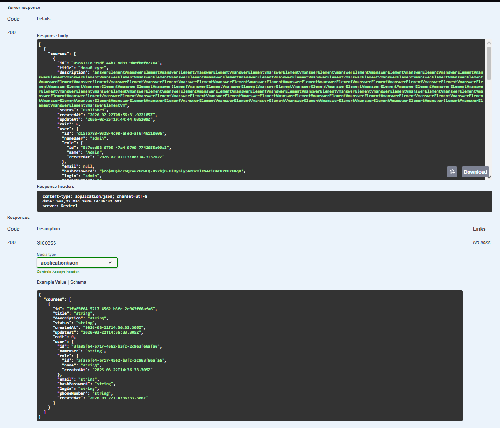
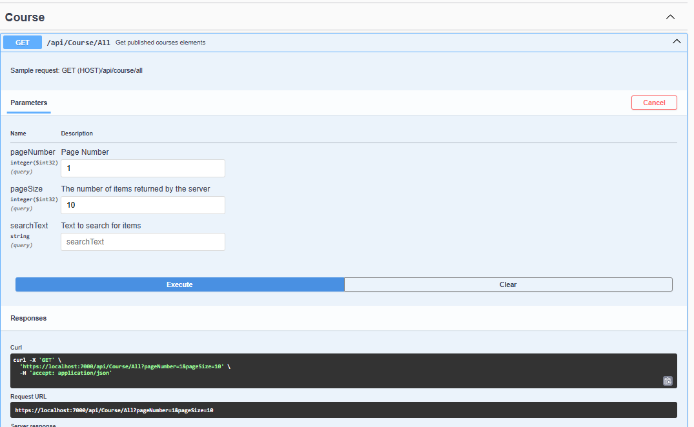
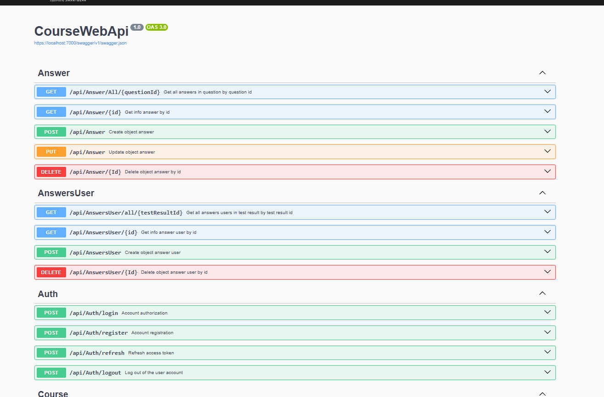
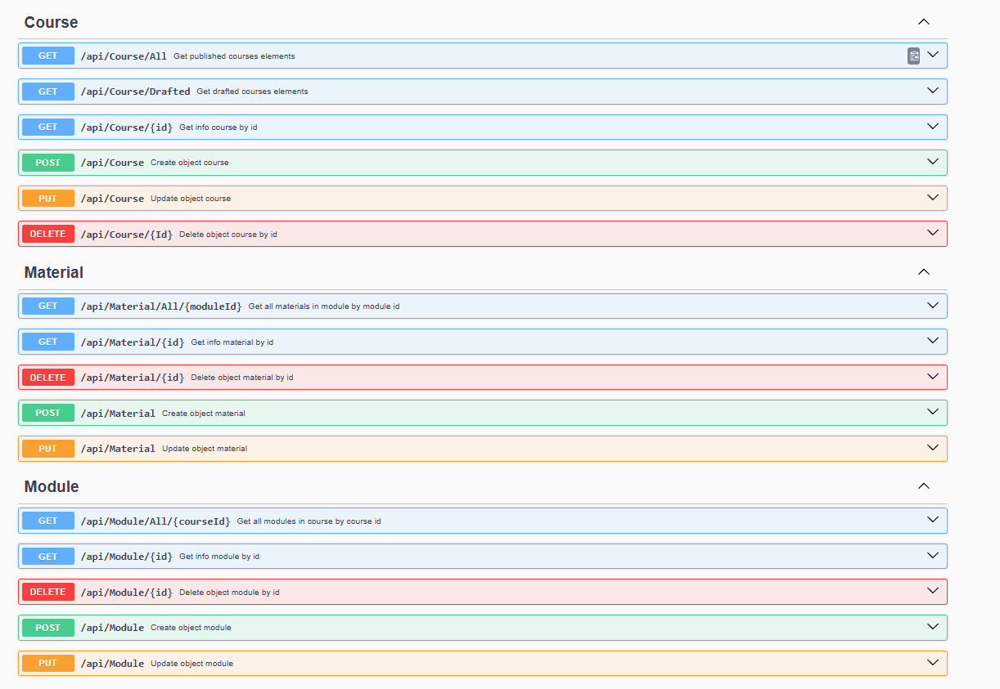
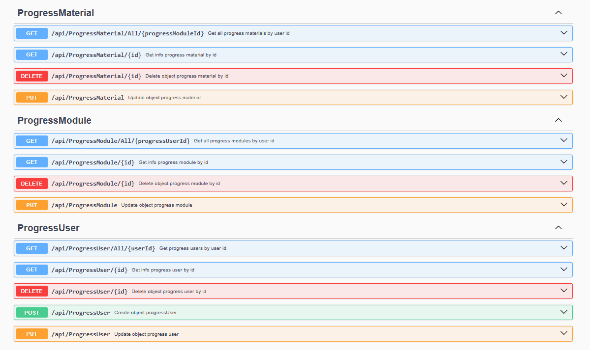
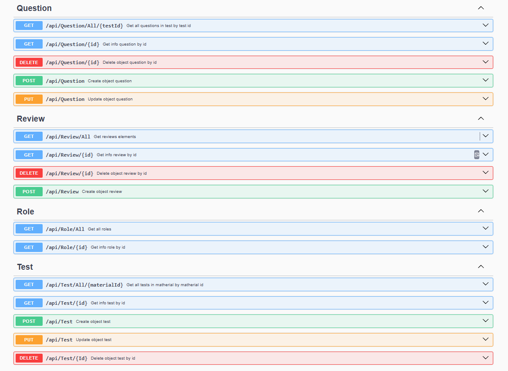
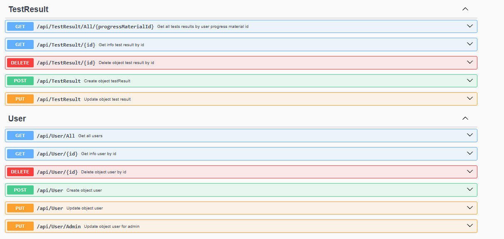
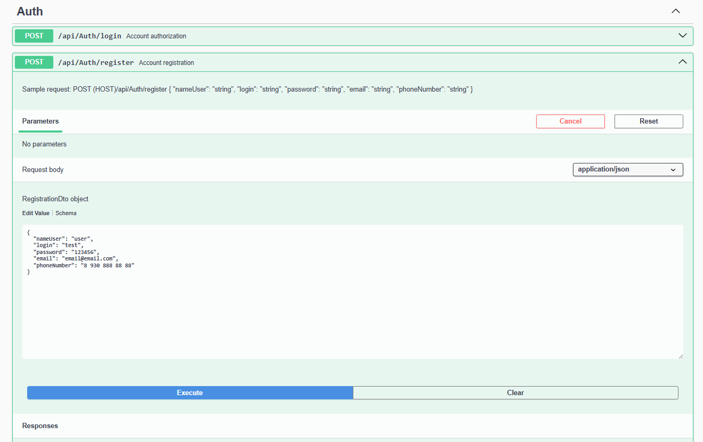
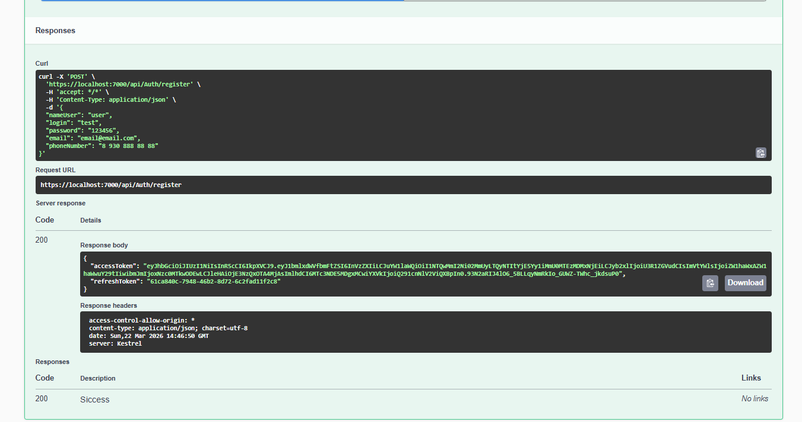

SkillForge — платформа для онлайн-обучения

Backend-система для управления курсами.

Стек технологий:
.NET 6 / ASP.NET Core 
Entity Framework Core
ORM, работа с PostgreSQL
MediatR
AutoMapper
FluentValidation
Serilog  JWT + Refresh Tokens
xUnit / Moq / Shouldly
Docker

Архитектура:
Проект построен на Clean Architecture с разделением на слои:
Domain → Бизнес-сущности (Course, Module, Test, Question, Answer)
Application → Бизнес-логика (CQRS handlers, интерфейсы)
Persistance → Доступ к данным (DbContext, конфигурации)
Presentation → API (контроллеры, middleware)

Pipeline behaviors в MediatR:
- LoggingBehavior — автоматическое логирование всех запросов
- ValidationBehavior — централизованная валидация

Основные возможности:
Управление контентом
Курсы — создание, редактирование, публикация
Модули — группировка материалов внутри курса
Материалы — учебный контент
Тесты — создание тестов с вопросами и вариантами ответов

Обучение и прогресс:
Прогресс пользователя — отслеживание прохождения курсов
Система тестирования — автоматическая проверка с подсчетом баллов
Частичное начисление баллов — учитываются частично правильные ответы
Автоматическое обновление прогресса — при завершении материалов и тестов

Безопасность:
JWT + Refresh Tokens — безопасная аутентификация
Ролевая модель — Admin, Couch, Student
Проверка прав доступа — в каждом хендлере

Дополнительно:
Пагинация и поиск — по курсам и пользователям
Отзывы и рейтинг — оценка курсов

Запуск проекта Через Docker 

Клонировать репозиторий
git clone https://github.com/imyach/Course-Api.git
cd Course-Api

Запустить контейнеры:
docker-compose up -d

Приложение доступно по адресу:
http://localhost:5000/swagger

Скрины:
 
 
 

Локальный запуск:
 1. Установить PostgreSQL
 2. Создать базу данных
 3. Обновить строку подключения в appsettings.json
 4. Применить миграции
dotnet ef database update --project Persistance --startup-project Presentation
 5. Запустить приложение
dotnet run --project Presentation

Тестирование:
 Запуск всех тестов
dotnet test

Покрытие: 114 интеграционных тестов
Используется InMemory Database для изоляции